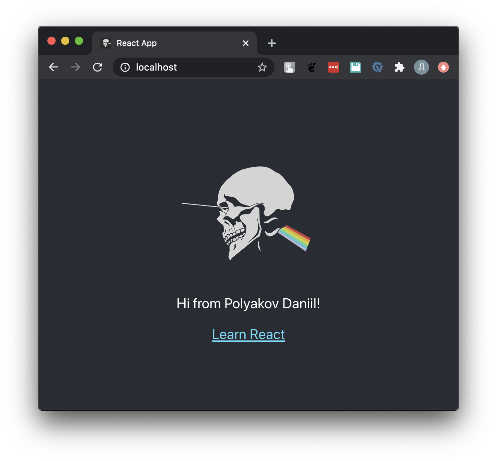

# React app. Hello world

## Задание

1. Написать приложение на `React`, используя команду  `npm create-react-app`
2. Поставить свое приветствие

## Запуск

```bash
docker build -t react-hello-world
docker run -it -p 80:80 react-hello-world
```

Далее откройте` localhost` в браузере

## Демо

